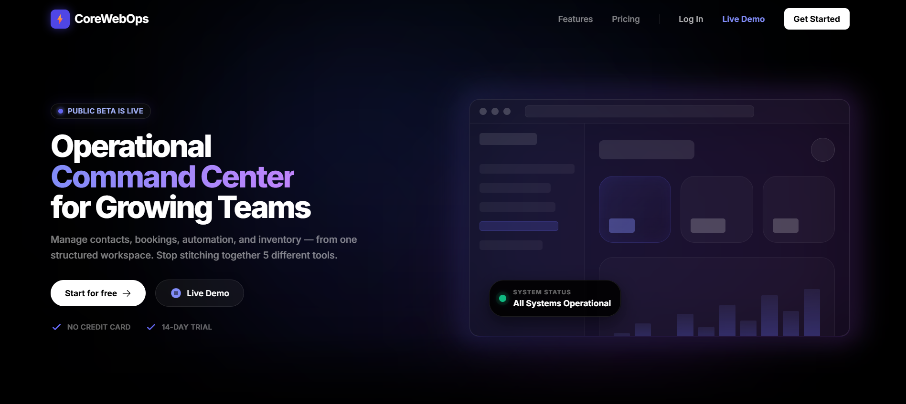
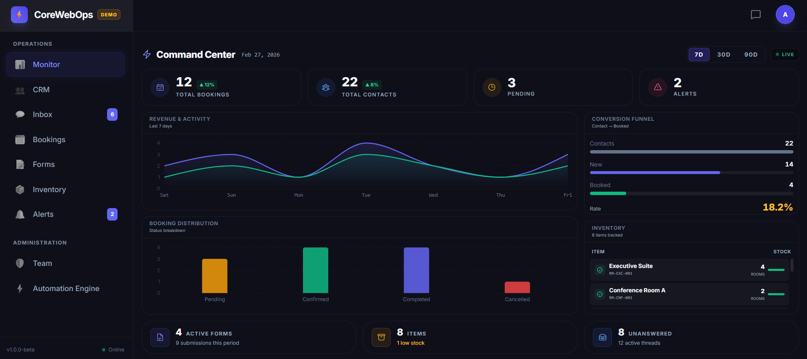
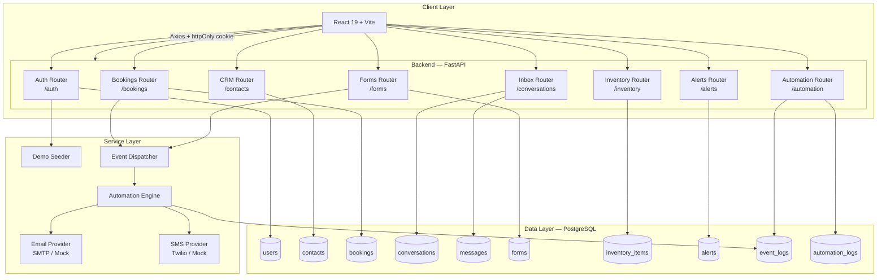

# CoreWebOps

> **The Operational Command Center for Growing Teams**
>
> Replaces: CRM · Bookings · Inbox · Forms · Inventory · Alerts · Automation · Reporting — all in one workspace.

[](https://corewebops.com)
[](https://fastapi.tiangolo.com)
[](https://react.dev)
[](https://postgresql.org)

---

## Screenshots

### Landing Page


### Dashboard — Command Center


---

## Overview

**CoreWebOps** is a full-stack SaaS platform built for small and mid-sized service businesses that are tired of juggling multiple disconnected tools. It provides a single, structured workspace for managing every part of operations — from first contact to completed booking.

### Core Modules

| Module | What it does |
|---|---|
| **CRM** | Manage contacts — customers, vendors, providers — with source tracking |
| **Bookings** | Create and track bookings across status lifecycle (pending → confirmed → completed) |
| **Inbox** | Multi-channel conversation threads (SMS, Email, Web) with unread tracking |
| **Forms** | Build and publish intake, inquiry, and feedback forms with a public URL |
| **Inventory** | Track stock levels, set reorder thresholds, get low-stock alerts |
| **Alerts** | Real-time system notifications with severity levels (info / warning / critical) |
| **Automation Engine** | Event-driven rule pipeline — auto-emails, SMS, thread creation, retry logic |
| **Dashboard** | Live KPI cards, revenue chart, booking distribution, conversion funnel |

---

## Architecture



---

## Tech Stack

| Layer | Technology |
|---|---|
| **Frontend** | React 19, Vite, TailwindCSS, React Router v6, Axios, Framer Motion |
| **Backend** | FastAPI, SQLAlchemy, Alembic, Pydantic v2 |
| **Database** | PostgreSQL 15 (Supabase) |
| **Auth** | JWT (python-jose) · bcrypt · httpOnly Cookies · CSRF double-submit |
| **Deployment** | GCP Cloud Run (Docker) via Cloud Build CI/CD |
| **Notifications** | SMTP Email · Twilio SMS (mock providers included) |

---

## Quick Start

### Prerequisites
- Python 3.11+
- Node.js 20+
- PostgreSQL 15 (or a [Supabase](https://supabase.com) project)

### 1. Clone & configure

```bash
# Backend env
cp backend/.env.example backend/.env
# → Set DATABASE_URL, SECRET_KEY, CORS_ORIGINS

# Frontend env
cp frontend/.env.example frontend/.env
# → Set VITE_API_URL=http://localhost:8000
```

### 2. Backend

```bash
cd backend
python -m venv venv
venv\Scripts\activate          # Windows
# source venv/bin/activate     # macOS/Linux

pip install -r requirements.txt
alembic upgrade head
uvicorn app.main:app --reload --port 8000
```

### 3. Frontend

```bash
cd frontend
npm install
npm run dev
```

### 4. Open

| URL | What |
|---|---|
| http://localhost:5173 | Frontend |
| http://localhost:5173 → **Live Demo** | Demo account (pre-seeded data) |
| http://localhost:8000/docs | Swagger API docs |
| http://localhost:8000/health | Health check |

---

## Docker (Full Stack)

```bash
docker-compose up --build
```

- Frontend → http://localhost:8080  
- Backend → http://localhost:8000

> `docker-compose.yml` spins up a local PostgreSQL container. In production, connect to Supabase/Cloud SQL via `DATABASE_URL`.

---

## Environment Variables

### Backend (`backend/.env`)

| Variable | Required | Description |
|---|---|---|
| `DATABASE_URL` | ✅ | PostgreSQL connection string |
| `SECRET_KEY` | ✅ | JWT signing key — `python -c "import secrets; print(secrets.token_urlsafe(32))"` |
| `ALGORITHM` | | JWT algorithm (default: `HS256`) |
| `ACCESS_TOKEN_EXPIRE_MINUTES` | | Token TTL (default: `30`) |
| `CORS_ORIGINS` | ✅ | Comma-separated allowed origins |
| `EMAIL_PROVIDER` | | `mock` or `smtp` |
| `SMTP_HOST` / `SMTP_USER` / `SMTP_PASSWORD` / `SMTP_FROM` | | SMTP credentials |
| `SMS_PROVIDER` | | `mock` or `twilio` |
| `TWILIO_SID` / `TWILIO_TOKEN` / `TWILIO_FROM` | | Twilio credentials |

### Frontend (`frontend/.env`)

| Variable | Required | Description |
|---|---|---|
| `VITE_API_URL` | ✅ | Backend base URL (e.g. `http://localhost:8000`) |

---

## Security

| Feature | Implementation |
|---|---|
| **Authentication** | JWT in httpOnly cookies — not localStorage |
| **CSRF** | Double-submit cookie (`X-CSRF-Token` header) |
| **Passwords** | bcrypt with automatic salting |
| **Rate Limiting** | Per-endpoint middleware |
| **CORS** | Strict origin whitelist |
| **Input Validation** | Pydantic schemas on every endpoint |
| **RBAC** | Owner / Staff roles with per-module permissions |

---

## RBAC

| Role | Access |
|---|---|
| **Owner** | Full access — all modules, settings, team management |
| **Staff** | Scoped access — Inbox, Bookings, Forms, Inventory (per-module toggle) |

---

## Project Structure

```
Core Web Ops/
├── backend/
│   ├── app/
│   │   ├── api/            # Route handlers
│   │   ├── core/           # Config, DB, security, CSRF, rate limiting
│   │   ├── models/         # SQLAlchemy models
│   │   ├── schemas/        # Pydantic schemas
│   │   ├── services/       # Business logic, automation, seeder
│   │   └── utils/          # Enums, helpers
│   ├── alembic/            # Database migrations
│   ├── tests/
│   ├── requirements.txt
│   └── Dockerfile
├── frontend/
│   ├── src/
│   │   ├── api/            # Axios API layer
│   │   ├── components/     # UI components
│   │   ├── context/        # Auth, Demo context
│   │   ├── pages/          # Page components
│   │   └── routes/         # Route definitions
│   └── Dockerfile
├── docs/screenshots/       # README assets
├── cloudbuild.yaml         # GCP CI/CD
├── docker-compose.yml
└── README.md
```

---

## GCP Deployment

The `cloudbuild.yaml` builds and deploys both services to Cloud Run automatically.

```bash
# Create secrets
gcloud secrets create DATABASE_URL --replication-policy="automatic"
gcloud secrets create SECRET_KEY   --replication-policy="automatic"
gcloud secrets create CORS_ORIGINS --replication-policy="automatic"
gcloud secrets create VITE_API_URL --replication-policy="automatic"

# Trigger deploy
gcloud builds submit --config cloudbuild.yaml \
  --substitutions _REGION=us-central1,_REPO=corewebops
```

```bash
# Verify
curl https://YOUR_BACKEND_URL/health
# → { "status": "healthy", "database": "connected" }
```

---

## Production Checklist

- [ ] Generate a strong `SECRET_KEY` — never use the dev default
- [ ] Set `CORS_ORIGINS` to your production frontend URL only
- [ ] Configure real `EMAIL_PROVIDER=smtp` and `SMS_PROVIDER=twilio`
- [ ] All secrets via GCP Secret Manager — never in code or Docker images
- [ ] Health check: `GET /health` returns DB connectivity and workspace count

---

© 2026 Core Web Ops Inc. — Built for operators, by engineers.
